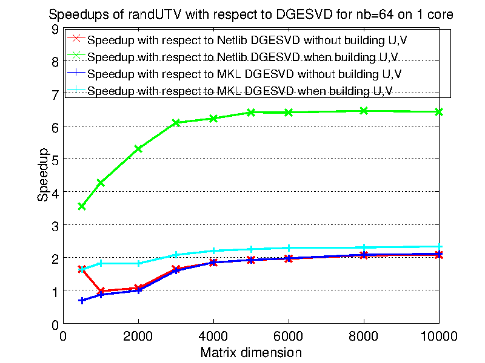
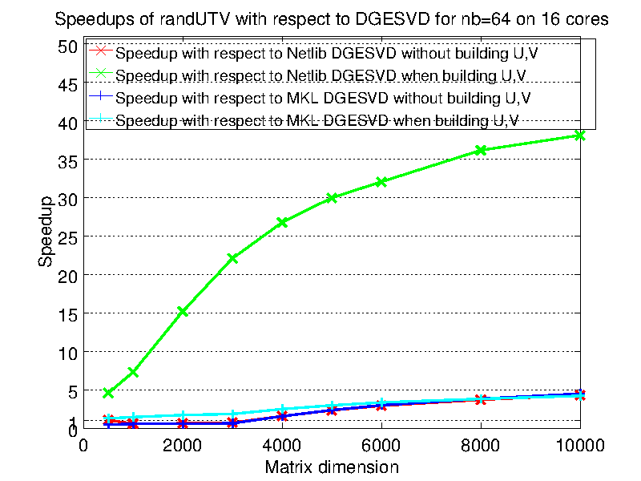

# randUTV

## Authors

* Per-Gunnar Martinsson,
  Dept. of Applied Mathematics,
  University of Colorado at Boulder,
  526 UCB, Boulder, CO 80309-0526, USA.

* Gregorio Quintana-Orti,
  Depto. de Ingenieria y Ciencia de Computadores,
  Universitat Jaume I,
  12.071 Castellon, Spain.

* Nathan Heavner,
  Dept. of Applied Mathematics,
  University of Colorado at Boulder,
  526 UCB, Boulder, CO 80309-0526, USA.

## Correspondence

Please send correspondence about the code to 
Gregorio Quintana-Ortí: <gquintan@icc.uji.es>

Correspondence about the paper should be sent to
Per-Gunnar J. Martinsson: <Per-gunnar.Martinsson@colorado.edu>

## License

New 3-clause BSD.
See file License.txt for more details.

## Disclaimer

This code is distributed in the hope that it will be useful, but
WITHOUT ANY WARRANTY EXPRESSED OR IMPLIED. 

## Description

(( To be updated ))

The new code can be downloaded from https://github.com/flame/randutv/.

The algorithm was originally implemented using the FLAME/C API with 
a variation of the compact WY transform we call the UT transform. 
However, an implementation that uses the original compact WY transform 
is also supplied so that many routines from LAPACK can be employed in a 
seemless fashion.

This implementation as well as the original implementation based on the UT
transform will eventually be included in the libflame library: 
https://github.com/flame/libflame/

We will appreciate feedback from the community on the use of this code.

## Performance benefit




## Citing this work

We ask those who benefit from this work 
to cite both of the following articles:

```
(( To be updated ))
```

## Details

We offer two variants of the code:

* LAPACK-compatible pure C code: 
  It uses compact WY transformations.
  The sources are stored in the lapack_compatible_sources folder.

* LAPACK-like libflame code: 
  It uses compact UT transformations.
  This code resembles the algorithm in the paper.
  The sources are stored in the libflame_sources folder.

### Details of LAPACK-compatible pure C code: 

The new code contains the following main routine:

```
int NoFLA_UTV_WY_blk_var2(
        int m_A, int n_A, double * buff_A, int ldim_A,
        int build_u, int m_U, int n_U, double * buff_U, int ldim_U,
        int build_v, int m_V, int n_V, double * buff_V, int ldim_V,
        int nb_alg, int pp, int n_iter ) {
//
// randUTV: It computes the UTV factorization of matrix A.
//
// Main features:
//   * BLAS-3 based.
//   * Compact WY transformations are used instead of UT transformations.
//   * No use of libflame.
//
// Matrices A, U, and V must be stored in column-order.
//
// Arguments:
// ----------
// m_A:      Number of rows of matrix A.
// n_A:      Number of columns of matrix A.
// buff_A:   Address of data in matrix A. Matrix to be factorized.
// ldim_A:   Leading dimension of matrix A.
// build_u:  If build_u==1, matrix U is built.
// m_U:      Number of rows of matrix U.
// n_U:      Number of columns of matrix U.
// buff_U:   Address of data in matrix U.
// ldim_U:   Leading dimension of matrix U.
// build_v:  If build_v==1, matrix V is built.
// m_V:      Number of rows of matrix V.
// n_V:      Number of columns of matrix V.
// buff_V:   Address of data in matrix V.
// ldim_V:   Leading dimension of matrix V.
// nb_alg:   Block size. Usual values for nb_alg are 32, 64, etc.
// pp:       Oversampling size. Usual values for pp are 5, 10, etc.
// n_iter:   Number of "power" iterations. Usual values are 2.
//
// Final comments:
// ---------------
// This code has been created from a libflame code. Hence, you can find some
// commented calls to libflame routines. We have left them to make it easier
// to interpret the meaning of the C code.
//
```

This routine is stored in the file `NoFLA_UTV_WY_blk_var2.c`.
The file `simple_test.c` contain a main program to test it.

### Details of LAPACK-like libflame code: 

The new code contains the following main routine:

```
int FLA_UTV_UT_blk_var1( FLA_Obj A, int build_u, FLA_Obj U, 
        int build_v, FLA_Obj V, int nb_alg, int pp, int n_iter ) {
//
// randUTV: It computes the UTV factorization of matrix A.
//
// Main features:
//   * BLAS-3 based.
//   * Use of Householder UT block transformations.
//   * Use of libflame.
//
// Arguments:
// ----------
// A:       (input)  Matrix to be factorized.
//          (output) Matrix factorized.
// build_u: (input)  If build_u==1, matrix U is built.
// U:       (output) Matrix U of the factorization.
// build_v: (input)  If build_v==1, matrix V is built.
// V:       (output) Matrix V of the factorization.
// nb_alg:  (input)  Block size. Usual values for nb_alg are 32, 64, etc.
// pp:      (input)  Oversampling size. Usual values for pp are 5, 10, etc.
// n_iter:  (input)  Number of "power" iterations. Usual values are 2.
//
```

This routine is stored in the file `FLA_UTV_UT_blk_var1.c`.
The file `simple_test.c` contain a main program to test it.


